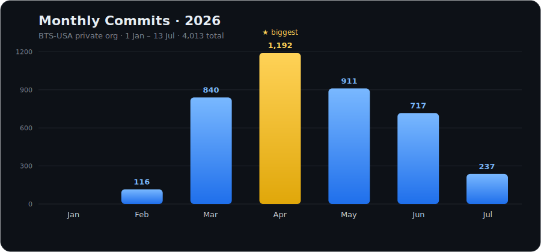
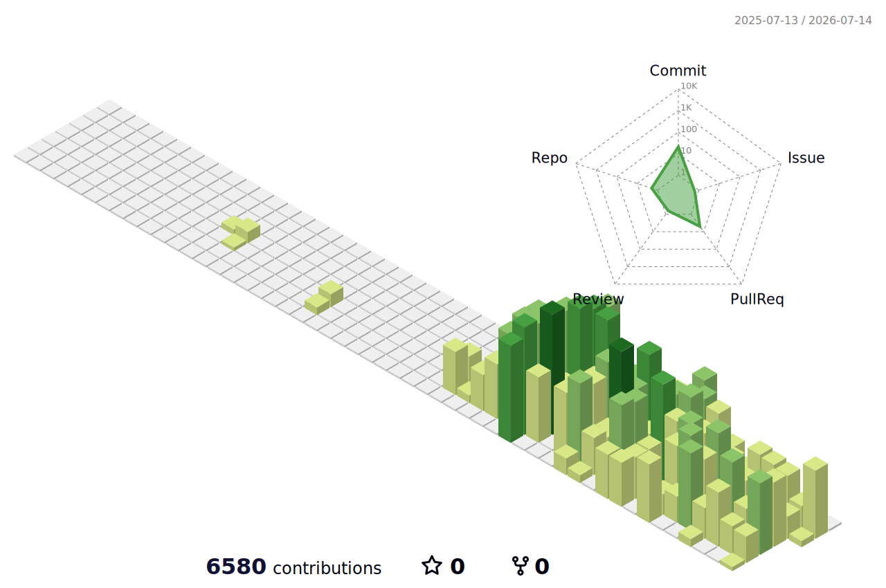
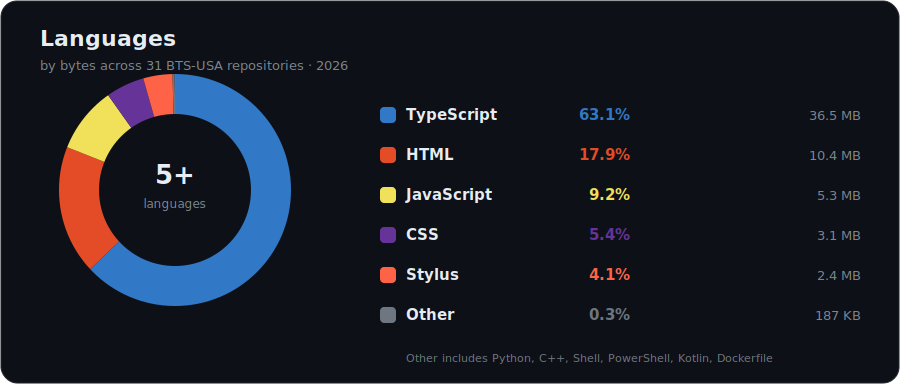

<table>
  <tr>
    <td width="230" align="center" valign="middle">
      
    </td>
    <td valign="middle">
      <h1>Joshua</h1>
      
    </td>
  </tr>
</table>

  

  
  
  

---

## 🚀 About Me

- 🔭 I'm currently working on **full-stack tooling for digital simulation platforms** — delivery reliability, automated readiness checks, and platform integrations
- 🌱 Currently exploring **AI / LLM integration and prompt engineering** for interactive simulations
- 💬 Ask me about **React, Node.js, MongoDB, REST API integration, and simulation platform tooling**
- 🌍 I build and ship across globally distributed teams, working in both **English and Spanish**
- 📸 Outside of code, I'm into **photography and filmmaking** — same eye for detail, different medium
- ⚡ Fun fact: I've officially declared myself a **doomcoder** — I probably *should* stop, but the passion for building just keeps me going

  <b>Total commits shipped in 2026</b> 
  

---

## 🛠️ Tech Stack

  
  
  
  
  

  
  
  
  
  

---

## 🔥 2026 by the Numbers

> Private engineering output across the **BTS-USA** organization · *1 Jan – 13 Jul 2026*.
> These are private-org contributions, so they don't show up in the public graphs below — but they're the real story.

  
  
  

  
  
  
  

<b>#1 committer of 91 org members — 8.3× the runner-up.</b>

### 📅 Monthly Cadence

  

---

## 🤖 AI Pair-Programming Usage

> Tokens processed by my AI coding CLIs. **Codex** history spans Feb–Jul; **Claude Code** keeps only ~30 days of transcripts (12 Jun – 13 Jul) — a far shorter window, yet the heavier load.

  
  
  

### 🟠 Claude Code · *12 Jun – 13 Jul (~30 days)*

  
  
  
  
  

### 🟢 Codex CLI · *Feb – 13 Jul (~5 months)*

  
  
  
  
  

"Tokens processed" = input + cache + output summed across all sessions; cache reads dominate (context is re-sent each turn — 94–96% cache hits). Peak months: Claude Code Jun 6.3B · Codex May 2.8B.

---

## 🧊 3D Contribution Calendar

  

---

## 🧬 Languages

  

---

## 📊 GitHub Stats

  
  

  

---

## 📈 Overall Contributions

  

---

## 🏆 Trophies

  

---

  <i>⭐️ Thanks for stopping by my profile!</i>

