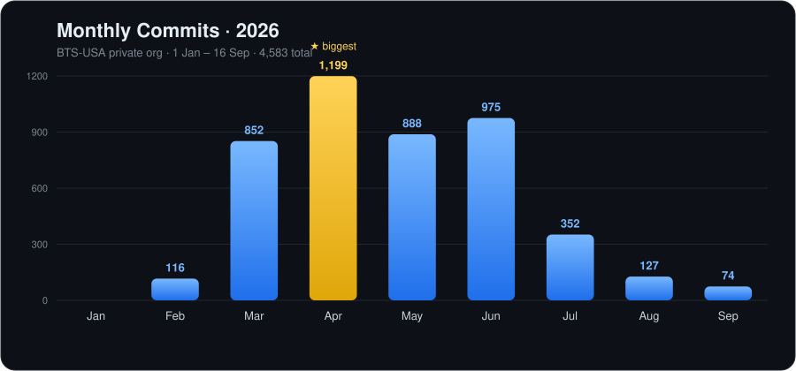
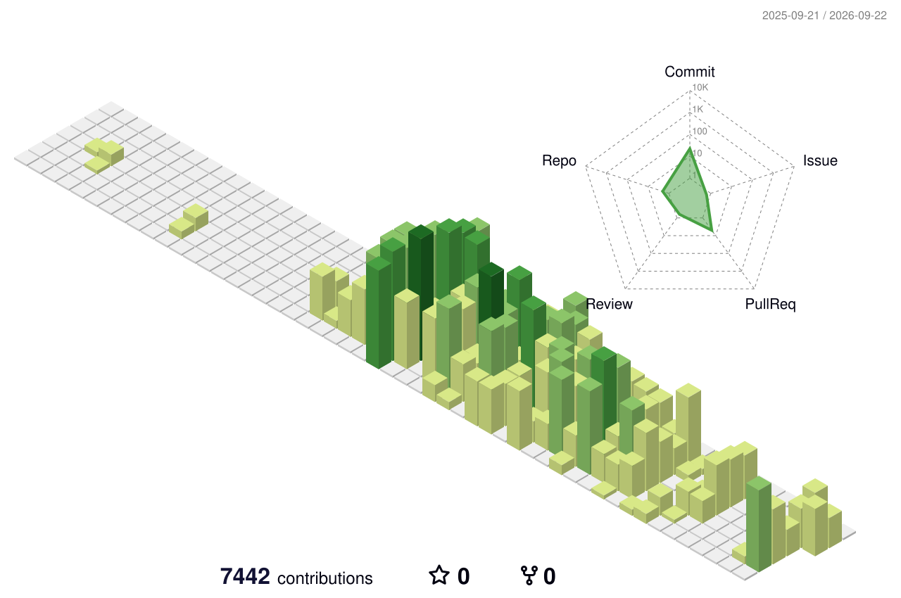
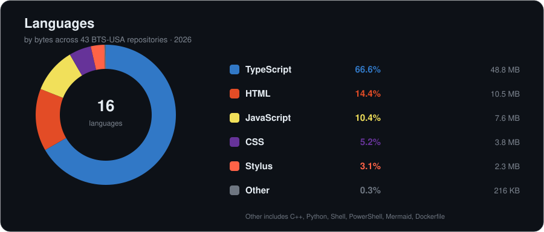

<p align="center">
  
  &nbsp;&nbsp;
  
</p>

<p align="center">
  
</p>

<p align="center">
  <a href="https://www.linkedin.com/in/joshuaduffill/"></a>
  <a href="mailto:joshua.duffill@bts.com"></a>
  <a href="https://YOUR-WEBSITE.com"></a>
</p>

---

## `> whoami`

> Full-stack developer building **digital simulation platforms** — the reliability tooling, readiness checks, and integrations that keep them shipping. A self-declared **doomcoder** who probably *should* stop, but the build never quite lets me.

```yaml
Now:         full-stack tooling for simulation platforms — reliability, readiness checks, integrations
Exploring:   AI / LLM integration & prompt engineering for interactive sims
Ask me:      React · Node.js · MongoDB · REST APIs · simulation tooling
Ships in:    English & Spanish, across globally distributed teams
Off-screen:  photography & filmmaking — same eye for detail, different medium
```

<p align="center">
<!-- STATS:COUNTER:START -->
  <sub><b>Total commits shipped in 2026</b></sub><br/>
  
<!-- STATS:COUNTER:END -->
</p>

---

## 🛠️ Tech Stack

<p align="center">
  
  
  
  
  
</p>
<p align="center">
  
  
  
  
  
</p>

---

## 🔥 2026 by the Numbers

<!-- STATS:NUMBERS:START -->
> Private engineering output across the **BTS-USA** organization · *1 Jan – 16 Sep 2026*.
> These are private-org contributions, so they don't show up in the public graphs below — but they're the real story.

<p align="center">
  
  
  
</p>
<p align="center">
  
  
  
  
</p>

<p align="center"><b>#1 committer of 90 org members — 4.3× the runner-up.</b></p>
<!-- STATS:NUMBERS:END -->

### 📅 Monthly Cadence

<p align="center">
  
</p>

---

## 🤖 AI Pair-Programming Usage

> Model usage across my local **Codex**, **Claude Code** and **Cursor** CLI sessions · *Feb – 24 Sep 2026*.

<p align="center">
  
  
  
  
</p>

### 🏅 Most-Used Models

<div align="center">

| # | Model | CLI | Requests | Share | Output | Active |
|:--|:--|:--|--:|--:|--:|:--|
| 🥇 | **gpt-5.5** | codex | 25,477 | 34.4% | 10.4M | Apr – Jul |
| 🥈 | **gpt-5.6-sol** | codex | 16,208 | 21.9% | 6.3M | Jul – Sep |
| 🥉 | **gpt-5.4** | codex | 8,182 | 11.0% | 4.5M | Mar – Jul |
| 4 | **Composer 2.5** | cursor | 7,451 | 10.1% | — | Mar – Sep |
| 5 | **gpt-5.6-terra** | codex | 4,401 | 5.9% | 1.7M | Jul – Sep |
| 6 | **claude-opus-5.5** | claude | 3,021 | 4.1% | 1.0M | Sep |
| 7 | **gpt-5.6-luna** | codex | 2,739 | 3.7% | 1.0M | Jul – Sep |
| 8 | **gpt-6-astra** | codex | 1,714 | 2.3% | 0.6M | Sep |
| 9 | **claude-opus-5** | claude | 1,676 | 2.3% | 1.6M | Sep |
| 10 | **gpt-6-luna** | codex | 1,065 | 1.4% | 0.4M | Sep |

</div>

<sub>Codex 61.5k requests · Cursor 7.5k · Claude Code 5.1k. Cursor keeps no token counts locally, so its output column is blank.</sub>

### 🔍 What the Sessions Say

<p align="center">
  
  
  
</p>

- **Features outpace fixes 2:1** — 2,431 `feat` commits against 1,193 `fix` across every repo touched in 2026.
- **The spec gets written first.** 2,264 commits are roadmap, phase and state documents — plans are versioned artifacts, not throwaway prompts.
- **Models are tiered by job.** Heavy reasoning tiers (`sol`, `astra`, Opus) take architecture and multi-file work; light tiers (`luna`, `terra`, `mini`) take tests, checks and CLI runs.
- **Reading dwarfs writing.** 95% of input tokens are cache hits and output is ~0.4% of volume — the budget goes on re-reading the codebase, not generating it.
- **Work concentrates hard.** Three repos — `naturgy_wop360_ba1`, `alcon-report-api`, `swedish_communities_ba2` — account for 58% of all Codex turns.

<sub>Scanned from 621 Codex, 544 Cursor and 90 Claude Code session files (`~/.codex` + `~/.cursor` + `~/.claude`).</sub>

---

## 🧊 3D Contribution Calendar

<p align="center">
  
</p>

---

## 🧬 Languages

<p align="center">
  
</p>

---

## 📊 GitHub Stats

<p align="center">
  
  
</p>

<p align="center">
  
</p>

---

## 📈 Overall Contributions

<p align="center">
  
</p>

---

## 🏆 Highlights

<!-- STATS:HIGHLIGHTS:START -->
<p align="center">
  
  
  
</p>
<p align="center">
  
  
  
</p>
<p align="center">
  
</p>
<!-- STATS:HIGHLIGHTS:END -->
<p align="center">
  
</p>

<sub align="center">Achievements reflect private BTS-USA org contributions, which don't appear in the public graphs above.</sub>

---

<p align="center">
  <i>⭐️ Thanks for stopping by my profile!</i>
</p>
